<div align="center">

<p align="center">
    
<p>

<h1 align="center">
dots.ocr
</h1>

[](https://huggingface.co/rednote-hilab/dots.mocr)
[](https://arxiv.org/abs/2512.02498)


<div align="center">
  <a href="https://dotsocr.xiaohongshu.com" target="_blank" rel="noopener noreferrer"><strong>🖥️ Live Demo</strong></a> | 
  <a href="assets/wechat.jpg" target="_blank" rel="noopener noreferrer"><strong>💬 WeChat</strong></a> | 
  <a href="https://www.xiaohongshu.com/user/profile/683ffe42000000001d021a4c" target="_blank" rel="noopener noreferrer"><strong>📕 rednote</strong></a> | 
  <a href="https://x.com/rednotehilab" target="_blank" rel="noopener noreferrer"><strong>🐦 X</strong></a>
</div>

</div>


## Introduction

**dots.ocr** Designed for universal accessibility, it possesses the capability to recognize virtually any human script. Beyond achieving state-of-the-art (SOTA) performance in standard multilingual document parsing among models of comparable size, dots.ocr-1.5 excels at converting structured graphics (e.g., charts and diagrams) directly into SVG code, parsing web screens and spotting scene text. 

## News 
* ```2026.03.19 ``` We have rebranded `dots.ocr-1.5` as [dots.mocr](https://github.com/rednote-hilab/dots.mocr). For technical details, please refer to our [paper](https://arxiv.org/abs/2603.13032v1). The model weights are available on Hugging Face: [dots.mocr](https://huggingface.co/rednote-hilab/dots.mocr) and [dots.mocr-svg](https://huggingface.co/rednote-hilab/dots.mocr-svg).
* ```2025.10.31 ``` 🚀 We release [dots.ocr.base](https://huggingface.co/rednote-hilab/dots.ocr.base), foundation VLM focus on OCR tasks, also the base model of [dots.ocr](https://huggingface.co/rednote-hilab/dots.ocr). Try it out!
* ```2025.07.30 ``` 🚀 We release [dots.ocr](https://huggingface.co/rednote-hilab/dots.ocr), — a multilingual documents parsing model based on 1.7b llm, with SOTA performance.


## Evaluation

### 1. Document Parsing

#### 1.1 Elo Score of different bench between latest models

<table>
  <thead>
    <tr>
      <th>models</th>
      <th>olmOCR-Bench</th>
      <th>OmniDocBench (v1.5)</th>
      <th>XDocParse</th>
      <th>Average</th>
    </tr>
  </thead>
  <tbody>
    <tr>
      <td>MonkeyOCR-pro-3B</td>
      <td>895.0</td>
      <td>811.3</td>
      <td>637.1</td>
      <td>781.1</td>
    </tr>
    <tr>
      <td>GLM-OCR</td>
      <td>884.2</td>
      <td>972.6</td>
      <td>820.7</td>
      <td>892.5</td>
    </tr>
    <tr>
      <td>PaddleOCR-VL-1.5</td>
      <td>897.3</td>
      <td>997.9</td>
      <td>866.4</td>
      <td>920.5</td>
    </tr>
    <tr>
      <td>HuanyuanOCR</td>
      <td>997.6</td>
      <td>1003.9</td>
      <td>951.1</td>
      <td>984.2</td>
    </tr>
    <tr>
      <td>dots.ocr</td>
      <td>1041.1</td>
      <td>1027.2</td>
      <td>1190.3</td>
      <td>1086.2</td>
    </tr>
    <!-- Highlighting dots.mocr row with bold tags -->
    <tr>
      <td><strong>dots.mocr</strong></td>
      <td><strong>1104.4</strong></td>
      <td><strong>1059.0</strong></td>
      <td><strong>1210.7</strong></td>
      <td><strong>1124.7</strong></td>
    </tr>
    <tr>
      <td>Gemini 3 Pro</td>
      <td>1180.4</td>
      <td>1128.0</td>
      <td>1323.7</td>
      <td>1210.7</td>
    </tr>
  </tbody>
</table>


> **Notes:** 
> - Results for Gemini 3 Pro, PaddleOCR-VL-1.5, and GLM-OCR were obtained via APIs, while HuanyuanOCR results were generated using local inference.
> - The Elo score evaluation was conducted using Gemini 3 Flash. The prompt can be found at: [Elo Score Prompt](tools/elo_score_prompt.py). These results are consistent with the findings on [ocrarena](https://www.ocrarena.ai/battle).


#### 1.2 olmOCR-bench
<table>
    <thead>
        <tr>
            <th>Model</th>
            <th>ArXiv</th>
            <th>Old scans math</th>
            <th>Tables</th>
            <th>Old scans</th>
            <th>Headers & footers</th>
            <th>Multi column</th>
            <th>Long tiny text</th>
            <th>Base</th>
            <th>Overall</th>
        </tr>
    </thead>
    <tbody>
        <tr>
            <td>Mistral OCR API</td>
            <td>77.2</td>
            <td>67.5</td>
            <td>60.6</td>
            <td>29.3</td>
            <td>93.6</td>
            <td>71.3</td>
            <td>77.1</td>
            <td>99.4</td>
            <td>72.0±1.1</td>
        </tr>
        <tr>
            <td>Marker 1.10.1</td>
            <td>83.8</td>
            <td>66.8</td>
            <td>72.9</td>
            <td>33.5</td>
            <td>86.6</td>
            <td>80.0</td>
            <td>85.7</td>
            <td>99.3</td>
            <td>76.1±1.1</td>
        </tr>
        <tr>
            <td>MinerU 2.5.4*</td>
            <td>76.6</td>
            <td>54.6</td>
            <td>84.9</td>
            <td>33.7</td>
            <td>96.6</td>
            <td>78.2</td>
            <td>83.5</td>
            <td>93.7</td>
            <td>75.2±1.1</td>
        </tr>
        <tr>
            <td>DeepSeek-OCR</td>
            <td>77.2</td>
            <td>73.6</td>
            <td>80.2</td>
            <td>33.3</td>
            <td>96.1</td>
            <td>66.4</td>
            <td>79.4</td>
            <td>99.8</td>
            <td>75.7±1.0</td>
        </tr>
        <tr>
            <td>Nanonets-OCR2-3B</td>
            <td>75.4</td>
            <td>46.1</td>
            <td>86.8</td>
            <td>40.9</td>
            <td>32.1</td>
            <td>81.9</td>
            <td>93.0</td>
            <td>99.6</td>
            <td>69.5±1.1</td>
        </tr>
        <tr>
            <td>PaddleOCR-VL*</td>
            <td>85.7</td>
            <td>71.0</td>
            <td>84.1</td>
            <td>37.8</td>
            <td>97.0</td>
            <td>79.9</td>
            <td>85.7</td>
            <td>98.5</td>
            <td>80.0±1.0</td>
        </tr>
        <tr>
            <td>Infinity-Parser 7B*</td>
            <td>84.4</td>
            <td>83.8</td>
            <td>85.0</td>
            <td>47.9</td>
            <td>88.7</td>
            <td>84.2</td>
            <td>86.4</td>
            <td>99.8</td>
            <td>82.5±?</td>
        </tr>
        <tr>
            <td>olmOCR v0.4.0</td>
            <td>83.0</td>
            <td>82.3</td>
            <td>84.9</td>
            <td>47.7</td>
            <td>96.1</td>
            <td>83.7</td>
            <td>81.9</td>
            <td>99.7</td>
            <td>82.4±1.1</td>
        </tr>
        <tr>
            <td>Chandra OCR 0.1.0*</td>
            <td>82.2</td>
            <td>80.3</td>
            <td>88.0</td>
            <td>50.4</td>
            <td>90.8</td>
            <td>81.2</td>
            <td>92.3</td>
            <td>99.9</td>
            <td>83.1±0.9</td>
        </tr>
        <tr>
            <td>dots.ocr</td>
            <td>82.1</td>
            <td>64.2</td>
            <td>88.3</td>
            <td>40.9</td>
            <td>94.1</td>
            <td>82.4</td>
            <td>81.2</td>
            <td>99.5</td>
            <td>79.1±1.0</td>
        </tr>
        <tr>
            <td><strong>dots.mocr</strong></td>
            <td><strong>85.9</strong></td>
            <td><strong>85.5</strong></td>
            <td><strong>90.7</strong></td>
            <td>48.2</td>
            <td>94.0</td>
            <td><strong>85.3</strong></td>
            <td>81.6</td>
            <td>99.7</td>
            <td><strong>83.9±0.9</strong></td>
        </tr>
    </tbody>
</table>


> **Note:**
> - The metrics are from [olmocr](https://github.com/allenai/olmocr), and our own internal evaluations.
> - We delete the Page-header and Page-footer cells in the result markdown.


#### 1.3 Other Benchmarks

<table>
  <thead>
    <tr>
      <th>Model Type</th>
      <th>Methods</th>
      <th>Size</th>
      <th>OmniDocBench(v1.5)<br>TextEdit↓</th>
      <th>OmniDocBench(v1.5)<br>Read OrderEdit↓</th>
      <th>pdf-parse-bench</th>
    </tr>
  </thead>
  <tbody>
    <!-- GeneralVLMs Group (Reversed Order, 3 rows) -->
    <tr>
      <td rowspan="3"><strong>GeneralVLMs</strong></td>
      <td>Gemini-2.5 Pro</td>
      <td>-</td>
      <td>0.075</td>
      <td>0.097</td>
      <td>9.06</td>
    </tr>
    <tr>
      <td>Qwen3-VL-235B-A22B-Instruct</td>
      <td>235B</td>
      <td>0.069</td>
      <td>0.068</td>
      <td><strong>9.71</strong></td>
    </tr>
    <tr>
      <td>gemini3pro</td>
      <td>-</td>
      <td>0.066</td>
      <td>0.079</td>
      <td>9.68</td>
    </tr>
    <!-- SpecializedVLMs Group (Reversed Order, 12 rows) -->
    <tr>
      <td rowspan="12"><strong>SpecializedVLMs</strong></td>
      <td>Mistral OCR</td>
      <td>-</td>
      <td>0.164</td>
      <td>0.144</td>
      <td>8.84</td>
    </tr>
    <tr>
      <td>Deepseek-OCR</td>
      <td>3B</td>
      <td>0.073</td>
      <td>0.086</td>
      <td>8.26</td>
    </tr>
    <tr>
      <td>MonkeyOCR-3B</td>
      <td>3B</td>
      <td>0.075</td>
      <td>0.129</td>
      <td>9.27</td>
    </tr>
    <tr>
      <td>OCRVerse</td>
      <td>4B</td>
      <td>0.058</td>
      <td>0.071</td>
      <td>--</td>
    </tr>
    <tr>
      <td>MonkeyOCR-pro-3B</td>
      <td>3B</td>
      <td>0.075</td>
      <td>0.128</td>
      <td>-</td>
    </tr>
    <tr>
      <td>MinerU2.5</td>
      <td>1.2B</td>
      <td>0.047</td>
      <td>0.044</td>
      <td>-</td>
    </tr>
    <tr>
      <td>PaddleOCR-VL</td>
      <td>0.9B</td>
      <td>0.035</td>
      <td>0.043</td>
      <td>9.51</td>
    </tr>
    <tr>
      <td>HunyuanOCR</td>
      <td>0.9B</td>
      <td>0.042</td>
      <td>-</td>
      <td>-</td>
    </tr>
    <tr>
      <td>PaddleOCR-VL1.5</td>
      <td>0.9B</td>
      <td>0.035</td>
      <td>0.042</td>
      <td>-</td>
    </tr>
    <tr>
      <td>GLMOCR</td>
      <td>0.9B</td>
      <td>0.04</td>
      <td>0.043</td>
      <td>-</td>
    </tr>
    <tr>
      <td>dots.ocr</td>
      <td>3B</td>
      <td>0.048</td>
      <td>0.053</td>
      <td>9.29</td>
    </tr>
    <tr>
      <td><u><strong>dots.mocr</strong></u></td>
      <td>3B</td>
      <td><strong>0.031</strong></td>
      <td><strong>0.029</strong></td>
      <td>9.54</td>
    </tr>
  </tbody>
</table>

> **Note:**
> - Metrics are sourced from [OmniDocBench](https://github.com/opendatalab/OmniDocBench) and other model publications. [pdf-parse-bench](https://github.com/phorn1/pdf-parse-bench) results are reproduced by Qwen3-VL-235B-A22B-Instruct.
> - Formula and Table metrics for OmniDocBench1.5 are omitted due to their high sensitivity to detection and matching protocols.


### 2. Structured Graphics Parsing
Visual languages (e.g., charts, graphics, chemical formulas, logos) encapsulate dense human knowledge. **dots.mocr** unifies the interpretation of these elements by parsing them directly into **SVG code**.

<table>
  <thead>
    <tr>
      <th rowspan="2" style="text-align: left;">Methods</th>
      <th colspan="3">Unisvg</th>
      <th rowspan="2">Chartmimic</th>
      <th rowspan="2">Design2Code</th>
      <th rowspan="2">Genexam</th>
      <th rowspan="2">SciGen</th>
      <th rowspan="2">ChemDraw</th>
    </tr>
    <tr>
      <th>Low-Level</th>
      <th>High-Level</th>
      <th>Score</th>
    </tr>
  </thead>
  <tbody>
    <tr>
      <td style="text-align: left;">OCRVerse</td>
      <td>0.632</td>
      <td>0.852</td>
      <td>0.763</td>
      <td>0.799</td>
      <td>-</td>
      <td>-</td>
      <td>-</td>
      <td>0.881</td>
    </tr>
    <tr>
      <td style="text-align: left;">Gemini 3 Pro</td>
      <td>0.563</td>
      <td>0.850</td>
      <td>0.735</td>
      <td>0.788</td>
      <td>0.760</td>
      <td>0.756</td>
      <td>0.783</td>
      <td>0.839</td>
    </tr>
    <tr>
      <td style="text-align: left;">dots.mocr</td>
      <td>0.850</td>
      <td>0.923</td>
      <td>0.894</td>
      <td>0.772</td>
      <td>0.801</td>
      <td>0.664</td>
      <td>0.660</td>
      <td>0.790</td>
    </tr>
    <tr>
      <td style="text-align: left;"><strong>dots.mocr-svg</strong></td>
      <td><strong>0.860</strong></td>
      <td><strong>0.931</strong></td>
      <td><strong>0.902</strong></td>
      <td><strong>0.905</strong></td>
      <td><strong>0.834</strong></td>
      <td><strong>0.8</strong></td>
      <td><strong>0.797</strong></td>
      <td><strong>0.901</strong></td>
    </tr>
  </tbody>
</table>


> **Note:**
> - We use the ISVGEN metric from [UniSVG](https://ryanlijinke.github.io/) to evaluate the parsing result. For benchmarks that do not natively support image parsing, we use the original images as input, and calculate the ISVGEN score between the rendered output and the original image. 
> - [OCRVerse](https://github.com/DocTron-hub/OCRVerse) results are derived from various code formats (e.g., SVG, Python), whereas results for Gemini 3 Pro and dots.mocr are based specifically on SVG code.
> - Due to the capacity constraints of a 3B-parameter VLM, dots.mocr may not excel in all tasks yet like svg. To complement this, we are simultaneously releasing dots.mocr-svg. We plan to further address these limitations in future updates.


### 3. General Vision Tasks

<table>
    <thead>
        <tr>
            <th>Model</th>
            <th>CharXiv_descriptive</th>
            <th>CharXiv_reasoning</th>
            <th>OCR_Reasoning</th>
            <th>infovqa</th>
            <th>docvqa</th>
            <th>ChartQA</th>
            <th>OCRBench</th>
            <th>AI2D</th>
            <th>CountBenchQA</th>
            <th>refcoco</th>
        </tr>
    </thead>
    <tbody>
        <tr>
            <td>Qwen3vl-2b-instruct</td>
            <td>62.3</td>
            <td>26.8</td>
            <td>-</td>
            <td>72.4</td>
            <td>93.3</td>
            <td>-</td>
            <td>85.8</td>
            <td>76.9</td>
            <td>88.4</td>
            <td>-</td>
        </tr>
        <tr>
            <td>Qwen3vl-4b-instruct</td>
            <td>76.2</td>
            <td>39.7</td>
            <td>-</td>
            <td>80.3</td>
            <td>95.3</td>
            <td>-</td>
            <td>88.1</td>
            <td>84.1</td>
            <td>84.9</td>
            <td>-</td>
        </tr>
        <tr>
            <td><strong>dots.mocr</strong></td>
            <td>77.4</td>
            <td>55.3</td>
            <td>22.85</td>
            <td>73.76</td>
            <td>91.85</td>
            <td>83.2</td>
            <td>86.0</td>
            <td>82.16</td>
            <td>94.46</td>
            <td>80.03</td>
        </tr>
    </tbody>
</table>


# Quick Start
## 1. Installation
### Install dots.mocr
```shell
conda create -n dots_mocr python=3.12
conda activate dots_mocr

git clone https://github.com/rednote-hilab/dots.mocr.git
cd dots.mocr

# Install pytorch, see https://pytorch.org/get-started/previous-versions/ for your cuda version
# pip install torch==2.7.0 torchvision==0.22.0 torchaudio==2.7.0 --index-url https://download.pytorch.org/whl/cu128
# install flash-attn==2.8.0.post2 for faster inference
pip install -e .
```

If you have trouble with the installation, try our [Docker Image](https://hub.docker.com/r/rednotehilab/dots.ocr) for an easier setup, and follow these steps:


### Download Model Weights
> 💡**Note:** Please use a directory name without periods (e.g., `DotsMOCR` instead of `dots.mocr`) for the model save path. This is a temporary workaround pending our integration with Transformers.
```shell
python3 tools/download_model.py

# with modelscope
python3 tools/download_model.py --type modelscope
```


## 2. Deployment
### vLLM inference
We highly recommend using vLLM for deployment and inference. **Since vLLM version 0.11.0, Dots OCR has been officially integrated into vLLM with verified performance** and you can use vLLM docker image directly (e.g, `vllm/vllm-openai:v0.11.0`) to deploy the model server.

```shell
# Launch vLLM model server
## dots.mocr
CUDA_VISIBLE_DEVICES=0 vllm serve rednote-hilab/dots.mocr --tensor-parallel-size 1 --gpu-memory-utilization 0.9 --chat-template-content-format string --served-model-name model --trust-remote-code

## dots.mocr-svg
CUDA_VISIBLE_DEVICES=0 vllm serve rednote-hilab/dots.mocr-svg --tensor-parallel-size 1 --gpu-memory-utilization 0.9 --chat-template-content-format string --served-model-name model --trust-remote-code

# vLLM API Demo
# See dots_mocr/model/inference.py and dots_mocr/utils/prompts.py for details on parameter and prompt settings 
# that help achieve the best output quality.
## document parsing
python3 ./demo/demo_vllm.py --prompt_mode prompt_layout_all_en 
## web parsing 
python3 ./demo/demo_vllm.py --prompt_mode prompt_web_parsing --image_path ./assets/showcase/origin/webpage_1.png
## scene spoting
python3 ./demo/demo_vllm.py --prompt_mode prompt_scene_spotting --image_path ./assets/showcase/origin/scene_1.jpg
## image parsing with svg code
python3 ./demo/demo_vllm_svg.py --prompt_mode prompt_image_to_svg 
## general qa
python3 ./demo/demo_vllm_general.py
```

### Hugginface inference
```shell
python3 demo/demo_hf.py
```

<details>
<summary><b>Hugginface inference details</b></summary>

```python
import torch
from transformers import AutoModelForCausalLM, AutoProcessor, AutoTokenizer
from qwen_vl_utils import process_vision_info
from dots_mocr.utils import dict_promptmode_to_prompt

model_path = "./weights/DotsMOCR"
model = AutoModelForCausalLM.from_pretrained(
    model_path,
    attn_implementation="flash_attention_2",
    torch_dtype=torch.bfloat16,
    device_map="auto",
    trust_remote_code=True
)
processor = AutoProcessor.from_pretrained(model_path, trust_remote_code=True)

image_path = "demo/demo_image1.jpg"
prompt = """Please output the layout information from the PDF image, including each layout element's bbox, its category, and the corresponding text content within the bbox.

1. Bbox format: [x1, y1, x2, y2]

2. Layout Categories: The possible categories are ['Caption', 'Footnote', 'Formula', 'List-item', 'Page-footer', 'Page-header', 'Picture', 'Section-header', 'Table', 'Text', 'Title'].

3. Text Extraction & Formatting Rules:
    - Picture: For the 'Picture' category, the text field should be omitted.
    - Formula: Format its text as LaTeX.
    - Table: Format its text as HTML.
    - All Others (Text, Title, etc.): Format their text as Markdown.

4. Constraints:
    - The output text must be the original text from the image, with no translation.
    - All layout elements must be sorted according to human reading order.

5. Final Output: The entire output must be a single JSON object.
"""

messages = [
        {
            "role": "user",
            "content": [
                {
                    "type": "image",
                    "image": image_path
                },
                {"type": "text", "text": prompt}
            ]
        }
    ]

# Preparation for inference
text = processor.apply_chat_template(
    messages, 
    tokenize=False, 
    add_generation_prompt=True
)
image_inputs, video_inputs = process_vision_info(messages)
inputs = processor(
    text=[text],
    images=image_inputs,
    videos=video_inputs,
    padding=True,
    return_tensors="pt",
)

inputs = inputs.to("cuda")

# Inference: Generation of the output
generated_ids = model.generate(**inputs, max_new_tokens=24000)
generated_ids_trimmed = [
    out_ids[len(in_ids) :] for in_ids, out_ids in zip(inputs.input_ids, generated_ids)
]
output_text = processor.batch_decode(
    generated_ids_trimmed, skip_special_tokens=True, clean_up_tokenization_spaces=False
)
print(output_text)

```

</details>

### Hugginface inference with CPU
Please refer to [CPU inference](https://github.com/rednote-hilab/dots.ocr/issues/1#issuecomment-3148962536)


## 3. Document Parse
**Based on vLLM server**, you can parse an image or a pdf file using the following commands:
```bash

# Parse all layout info, both detection and recognition
# Parse a single image
python3 dots_mocr/parser.py demo/demo_image1.jpg
# Parse a single PDF
python3 dots_mocr/parser.py demo/demo_pdf1.pdf  --num_thread 64  # try bigger num_threads for pdf with a large number of pages

# Layout detection only
python3 dots_mocr/parser.py demo/demo_image1.jpg --prompt prompt_layout_only_en

# Parse text only, except Page-header and Page-footer
python3 dots_mocr/parser.py demo/demo_image1.jpg --prompt prompt_ocr


```
**Based on Transformers**, you can parse an image or a pdf file using the same commands above, just add `--use_hf true`. 

> Notice: transformers is slower than vllm, if you want to use demo/* with transformers，just add `use_hf=True` in `DotsMOCRParser(..,use_hf=True)`

<details>
<summary><b>Output Results</b></summary>

1.  **Structured Layout Data** (`demo_image1.json`): A JSON file containing the detected layout elements, including their bounding boxes, categories, and extracted text.
2.  **Processed Markdown File** (`demo_image1.md`): A Markdown file generated from the concatenated text of all detected cells.
    *   An additional version, `demo_image1_nohf.md`, is also provided, which excludes page headers and footers for compatibility with benchmarks like Omnidocbench and olmOCR-bench.
3.  **Layout Visualization** (`demo_image1.jpg`): The original image with the detected layout bounding boxes drawn on it.

</details>


## 4. Demo
Have fun with the [live demo](https://dotsocr.xiaohongshu.com/).


### Examples for document parsing
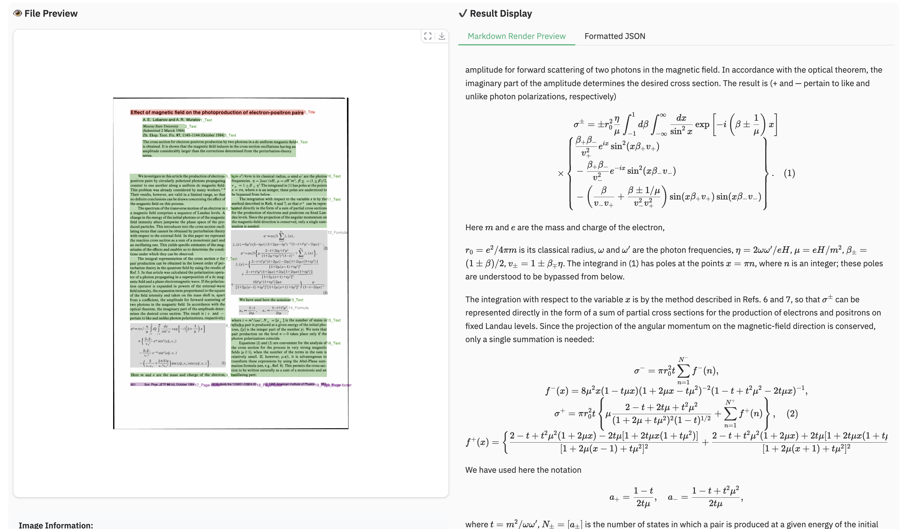
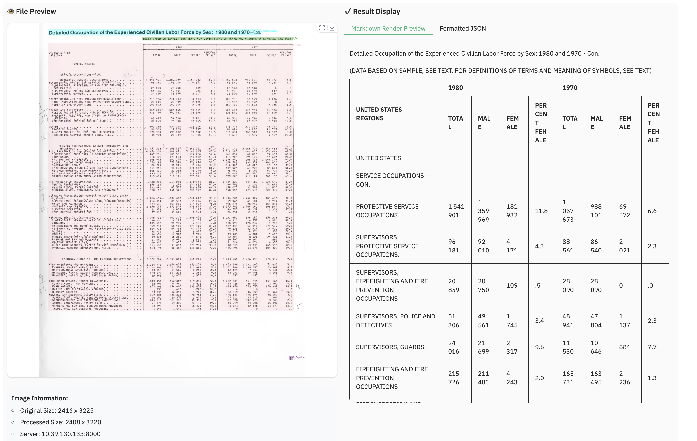
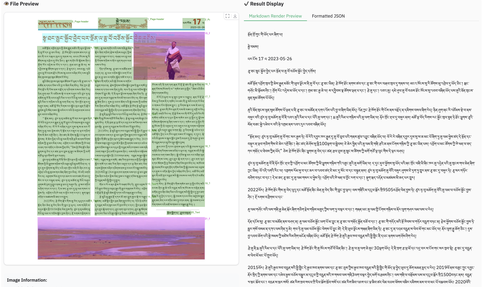
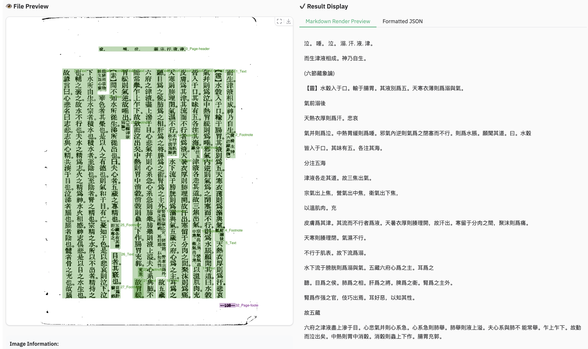
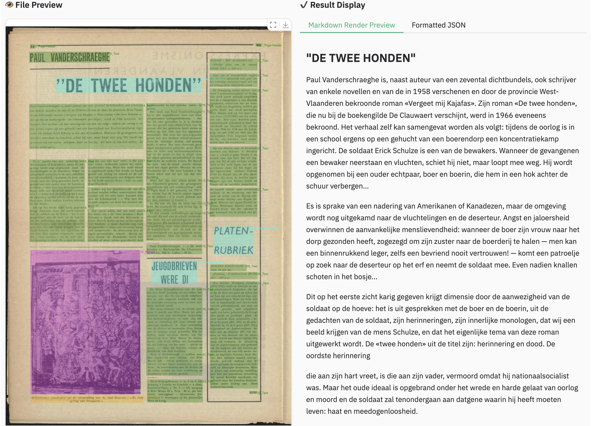
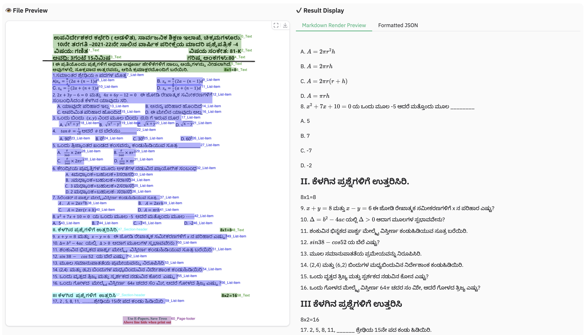
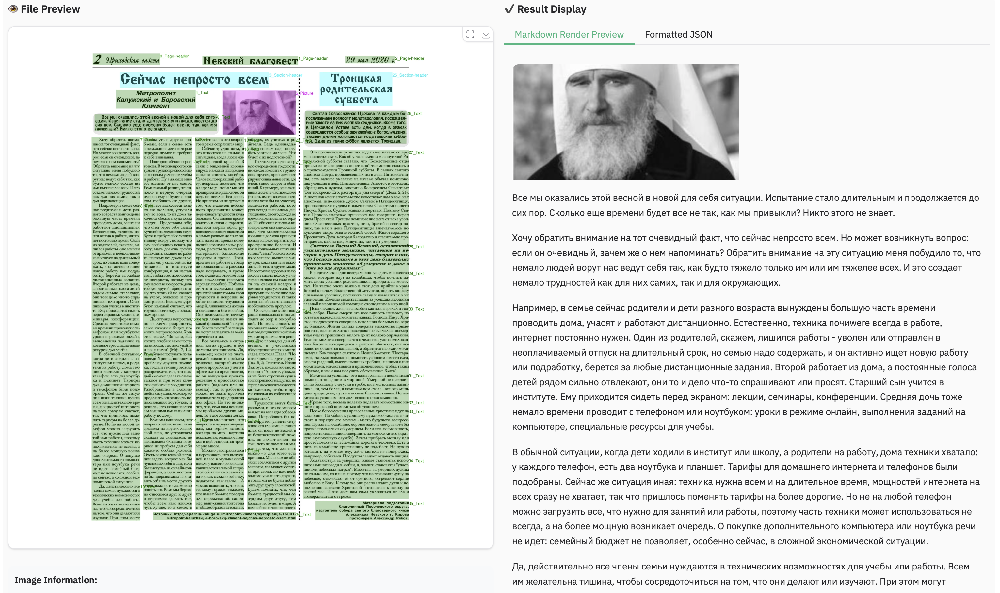


### Examples for image parsing
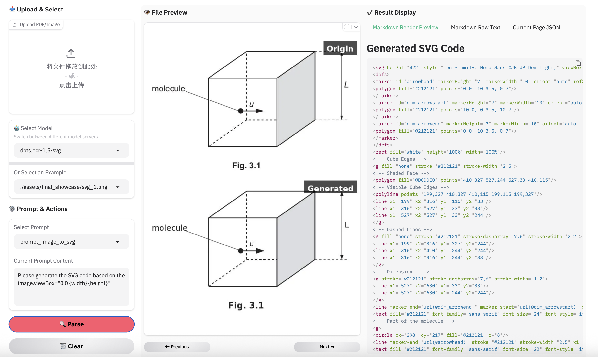
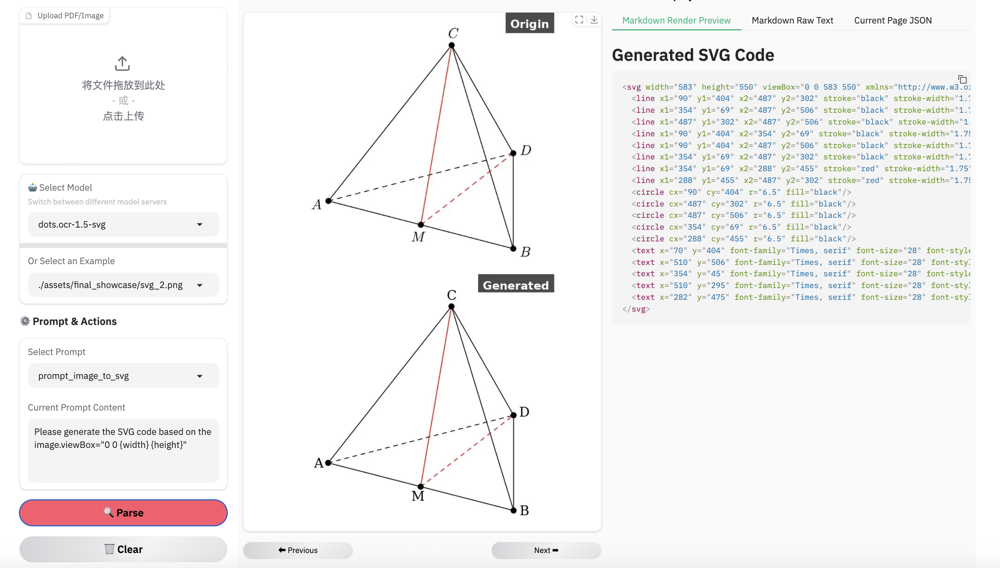
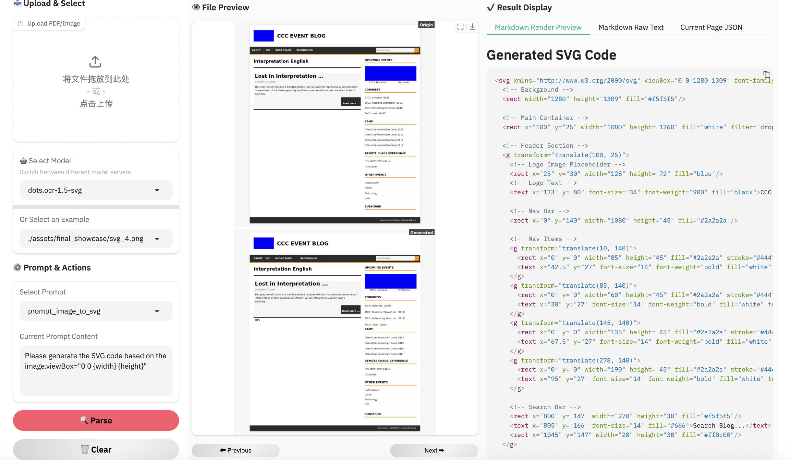
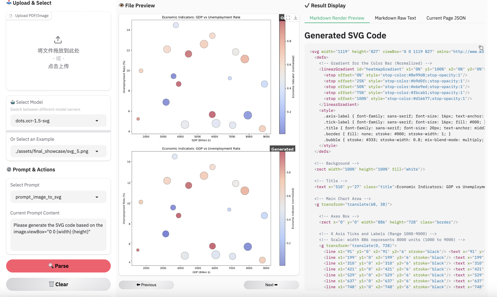
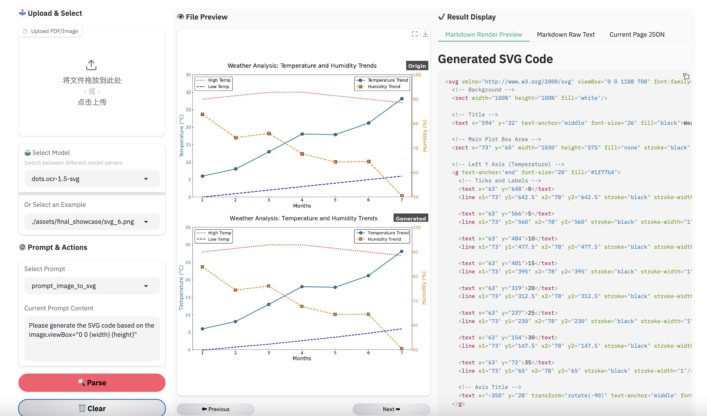

> **Note:**
> - Inferenced by dots.mocr-svg

### Example for web parsing
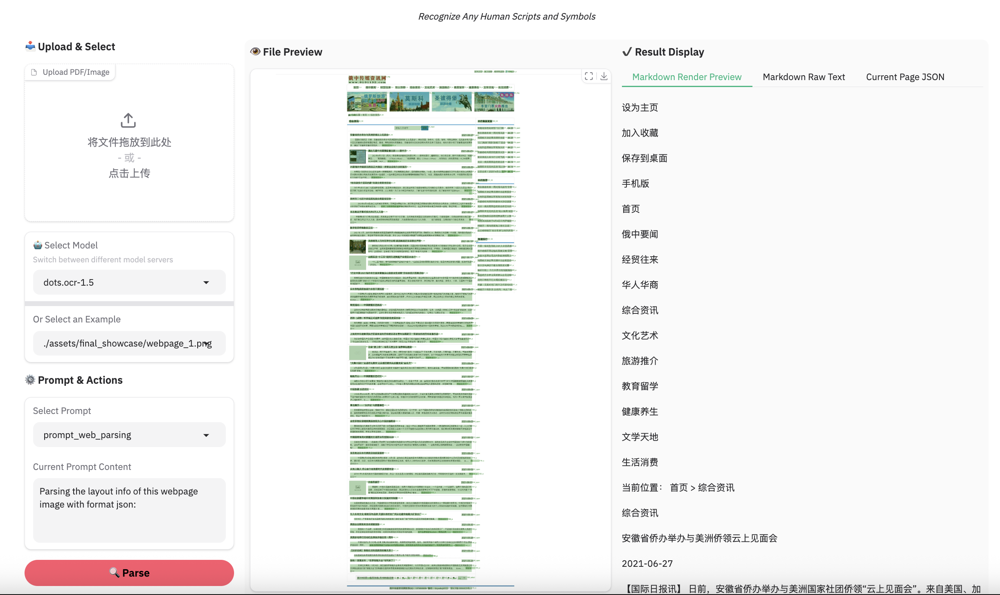
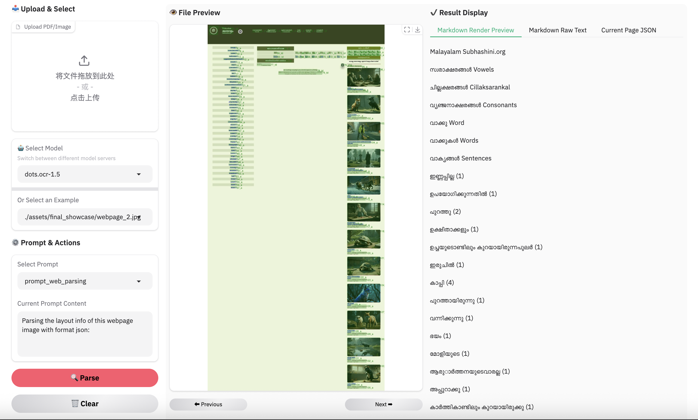

### Examples for scene spotting
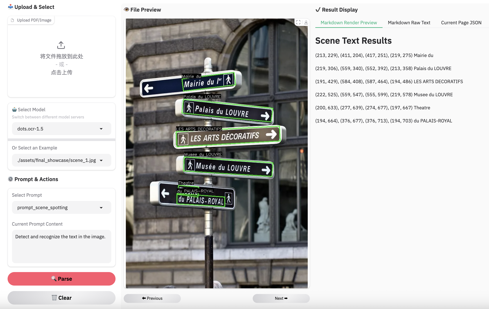
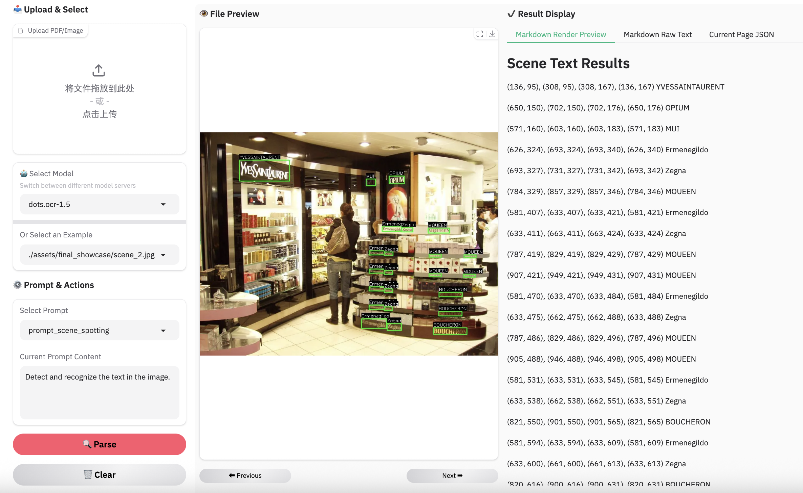


# Limitation & Future Work

- **Complex Document Elements:**
  - **Table&Formula**: The extraction of complex tables and mathematical formulas persists as a difficult task given the model's compact architecture.
  - **Picture**: We have adopted an SVG code representation for parsing structured graphics; however, the performance has yet to achieve the desired level of robustness.

- **Parsing Failures:** While we have reduced the rate of parsing failures compared to the previous version, these issues may still occur occasionally. We remain committed to further resolving these edge cases in future updates. 


# Citation

```BibTeX
@misc{zheng2026multimodalocrparsedocuments,
      title={Multimodal OCR: Parse Anything from Documents}, 
      author={Handong Zheng and Yumeng Li and Kaile Zhang and Liang Xin and Guangwei Zhao and Hao Liu and Jiayu Chen and Jie Lou and Jiyu Qiu and Qi Fu and Rui Yang and Shuo Jiang and Weijian Luo and Weijie Su and Weijun Zhang and Xingyu Zhu and Yabin Li and Yiwei ma and Yu Chen and Zhaohui Yu and Guang Yang and Colin Zhang and Lei Zhang and Yuliang Liu and Xiang Bai},
      year={2026},
      eprint={2603.13032},
      archivePrefix={arXiv},
      primaryClass={cs.CV},
      url={https://arxiv.org/abs/2603.13032}, 
}
```

```BibTeX
@misc{li2025dotsocrmultilingualdocumentlayout,
      title={dots.ocr: Multilingual Document Layout Parsing in a Single Vision-Language Model}, 
      author={Yumeng Li and Guang Yang and Hao Liu and Bowen Wang and Colin Zhang},
      year={2025},
      eprint={2512.02498},
      archivePrefix={arXiv},
      primaryClass={cs.CV},
      url={https://arxiv.org/abs/2512.02498}, 
}
```
